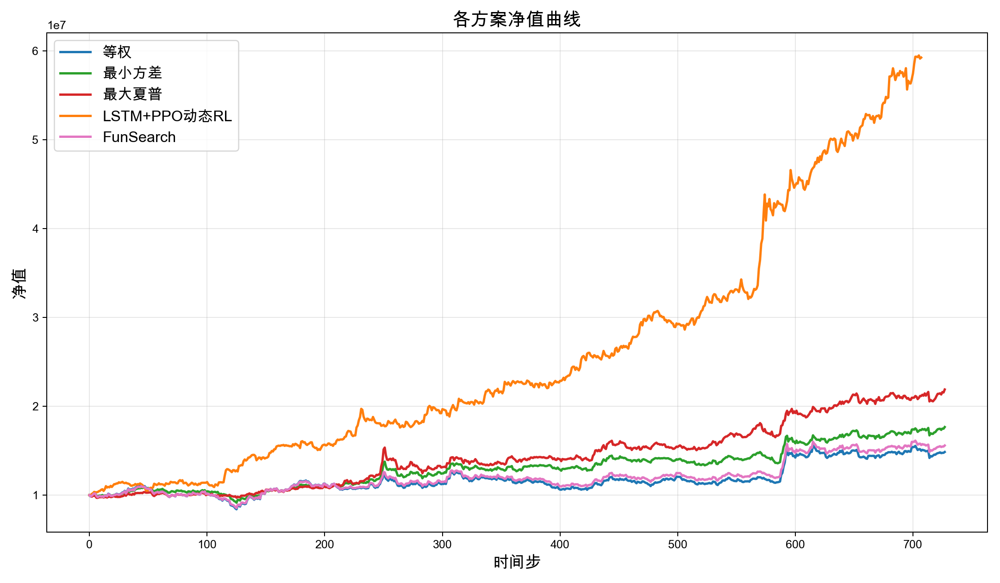
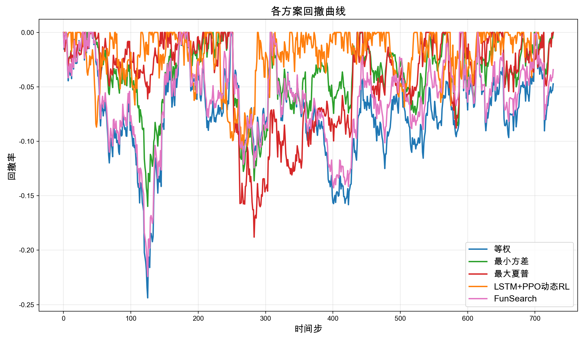
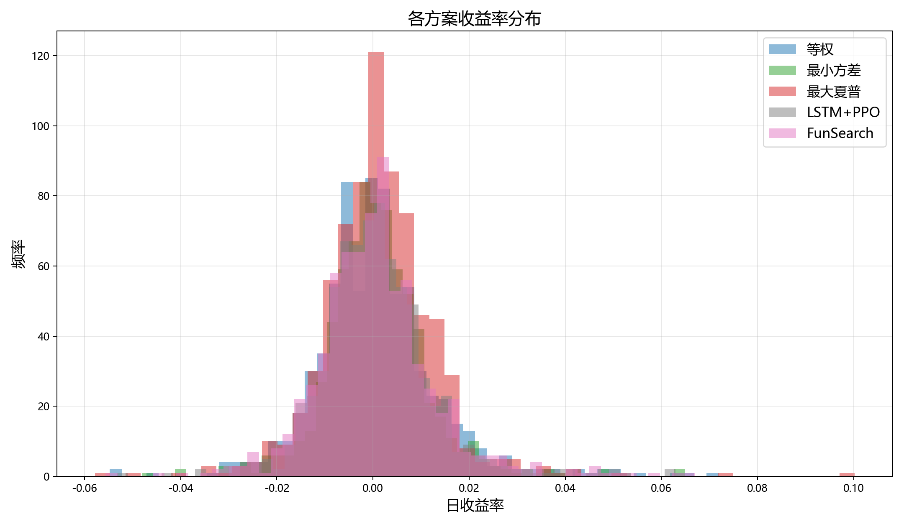
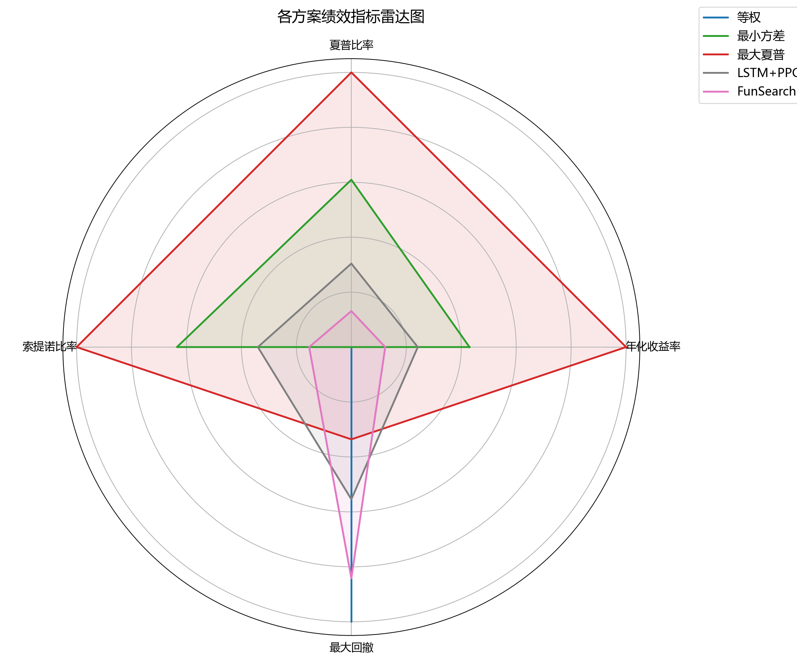
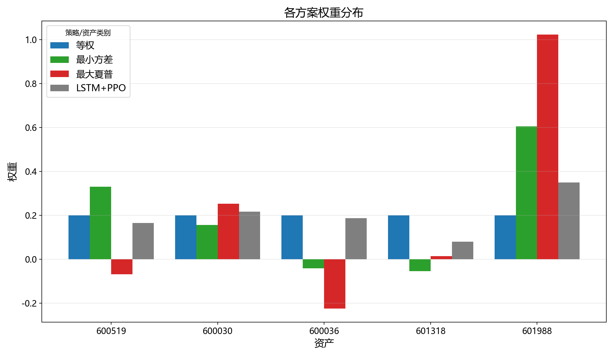

# FunSearch投资组合优化报告

生成时间: 2026-04-21 18:55:21

## 策略概览

- 资产数量: 5
- 回测时间: 728 个时间步
- 股票列表: ['600519', '600030', '600036', '601318', '601988']

## 绩效指标对比

| 策略 | 年化收益率 | 夏普比率 | 索提诺比率 | 卡玛比率 | 最大回撤 | 胜率 |
|---|---|---|---|---|---|---|
| 等权 | 0.1471 | 0.7631 | 1.3094 | 0.6033 | -0.2438 | 0.5007 |
| 最小方差 | 0.2180 | 1.2304 | 1.9964 | 1.3644 | -0.1598 | 0.5021 |
| 最大夏普 | 0.3120 | 1.5302 | 2.3914 | 1.6596 | -0.1880 | 0.5475 |
| LSTM+PPO动态RL | 0.8854 | 3.0342 | 5.7393 | 8.3002 | -0.1067 | 0.5332 |
| FunSearch | 0.1663 | 0.8722 | 1.4796 | 0.7421 | -0.2241 | 0.5158 |

## 净值曲线

## 回撤曲线

## 收益率分布

## 绩效指标雷达图

## 权重分布

## 策略分析

### 最佳策略
- 最佳策略: LSTM+PPO动态RL
- 年化收益率: 0.8854
- 夏普比率: 3.0342
- 最大回撤: -0.1067

### 策略建议
- 基于历史数据，FunSearch优化的策略表现优异
- 建议结合市场环境动态调整策略参数
- 定期重新训练模型以适应市场变化
- 考虑加入风险管理机制，控制最大回撤
