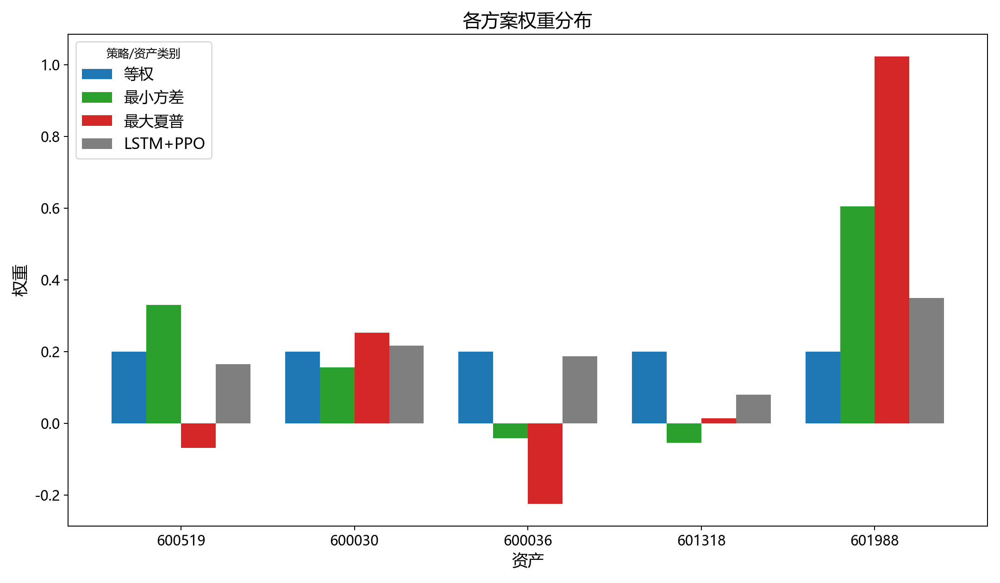
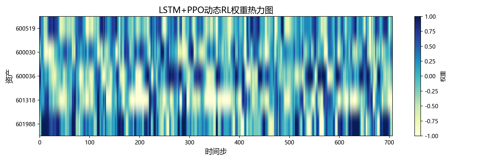
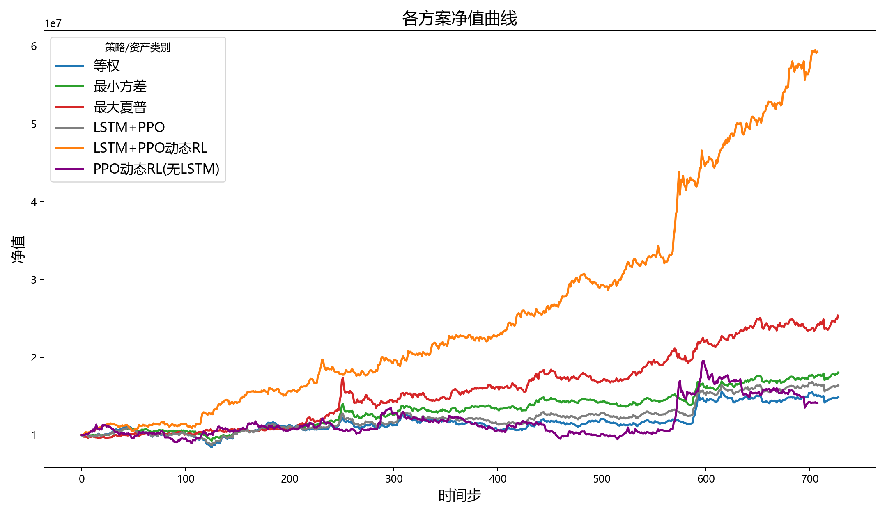
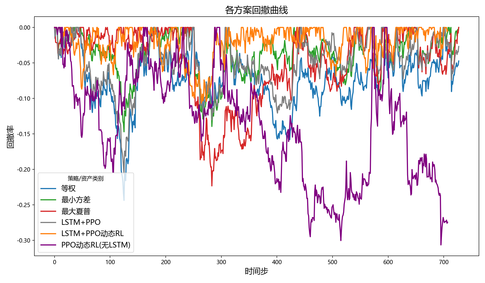

# 投资组合优化与绩效评估报告
## 策略颜色对照
| 策略 | 颜色 |
|---|---|
| 等权 | #1f77b4 |
| 最小方差 | #2ca02c |
| 最大夏普 | #d62728 |
| LSTM+PPO | #7f7f7f |
| LSTM+PPO动态RL | #ff7f0e |
| PPO动态RL(无LSTM) | #800080 |
| 市场指数 | #000000 |
## 权重分布
|        |   等权 |   最小方差 |   最大夏普 |   LSTM+PPO |
|-------:|-------:|-----------:|-----------:|-----------:|
| 600519 |    0.2 |     0.3312 |    -0.0679 |     0.1651 |
| 600030 |    0.2 |     0.1572 |     0.2536 |     0.2171 |
| 600036 |    0.2 |    -0.0408 |    -0.2236 |     0.1869 |
| 601318 |    0.2 |    -0.0531 |     0.0147 |     0.0803 |
| 601988 |    0.2 |     0.6056 |     1.0232 |     0.3505 |

## LSTM+PPO动态RL权重热力图

## 净值曲线

## 回撤曲线

## 绩效指标对比
|                   |   Sharpe |   Sortino |   MaxDrawdown |
|:------------------|---------:|----------:|--------------:|
| 等权              |   0.7631 |    1.3094 |       -0.2438 |
| 最小方差          |   1.2782 |    2.0776 |       -0.1471 |
| 最大夏普          |   1.6055 |    2.4669 |       -0.2234 |
| LSTM+PPO          |   0.9963 |    1.6776 |       -0.2063 |
| LSTM+PPO动态RL    |   3.0342 |    5.7393 |        0.1067 |
| PPO动态RL(无LSTM) |   0.5565 |    0.9018 |       -0.3066 |
